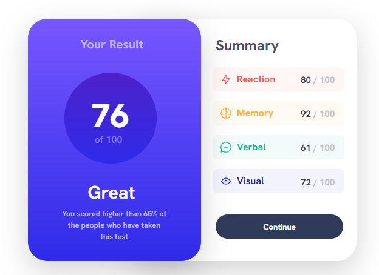
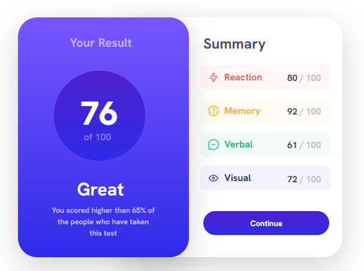

# Frontend Mentor - Results summary component solution

This is a solution to the [Results summary component challenge on Frontend Mentor](https://www.frontendmentor.io/challenges/results-summary-component-CE_K6s0maV). Frontend Mentor challenges help you improve your coding skills by building realistic projects. 

## Table of contents

- [Overview](#overview)
  - [The challenge](#the-challenge)
  - [Screenshot](#screenshot)
  - [Links](#links)
- [My process](#my-process)
  - [Built with](#built-with)
  - [What I learned](#what-i-learned)
  - [Continued development](#continued-development)
  - [Useful resources](#useful-resources)
- [Author](#author)
- [Acknowledgments](#acknowledgments)


## Overview

### The challenge

Users should be able to:

- View the optimal layout for the interface only on desktop sreen am sorry wasn't able to do mobile view
- See hover and focus states for all interactive elements on the page


### Screenshot

 : idle page
 : for active status


### Links

- Solution URL: [Add solution URL here](https://www.frontendmentor.io/challenges/results-summary-component-CE_K6s0maV/solutions/new)
- Live Site URL: [Add live site URL here](https://your-live-site-url.com)

## My process

### Built with

- Semantic HTML5 markup
- CSS custom properties
- Mobile-first workflow
- [bootstrap](https://getbootstrap.com/) - For styles


### What I learned

I was able to find out that this html code does'nt actually put the site in actual size according to user's device but I was taught that what it does but with my learnings from this project I think it has a part to play.

And I was also able to find out that this media screen css code won't work if you've done something cotrary in your inline html.

These are the code below:

```html
<meta name="viewport" content="width=device-width, initial-scale=1.0">
```
```css
@media screen and (max-width:1400px) and (min-width:376px) {
    #second{
        margin: ;
    }.container{
        margin-top: ;
        margin-left: ;
    }
}
```

If you want more help with writing markdown, we'd recommend checking out [The Markdown Guide](https://www.markdownguide.org/) to learn more.


### Continued development

Still having problem with media query. Though I tried using it in some of my code but I wasn't able to perfect the mobile view that why I didn't
bother including it. But I want to say it is a very important aspect of coding because most people out there does there things on the phone it's
hard to see someone who wants to check a site then use his laptop.


### Useful resources

- [BOOTSTRAP](https://getbootstrap.com/) - This helped me with the styling. I really liked this pattern and will use it going forward.
- [w3 schools](https://www.w3schools.com/) - This is an amazing article which helped me understand media query. I'd recommend it to anyone still learning this concept.


## Author

- Website - [Samuel Ejalonibu](https://www.your-site.com)
- Frontend Mentor - [@SamuelWorld20](https://www.frontendmentor.io/profile/SamuelWorld20)
- Twitter - [@gold_fish126](https://twitter.com/gold_fish126)


## Acknowledgments

I want to appreciate the makers of chat-gpt that AI as been very useful to me. And I also want to ackowledge my teacher the one who first introduced me to programming Mr Kehinde Durodola and also APTECH computer education that built me up.

